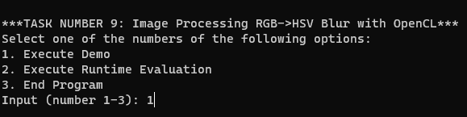
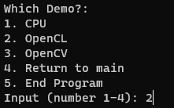

# Task 9: Image Processing RGB -> HSV Blur

This program implements the process of parallelizing the conversion of an image from RGB to HSV, and the implementation of Box Blur using OpenCL. The application is evaluated and compared with an application without parallelization and with an existing implementation from OpenCV based on its runtime.

## Dependencies

* Technology: OpenCL
* Programming Language: C++
* IDE: Visual Studio 2022
* To load files, save files, or show image operations: OpenCV version 4.8.1
* As test files: animal and nature images from [Belegaufgaben](https://www.dropbox.com/s/5uhqu8m8a7entcd/images.zip?dl=0)

## Class Diagram

## Getting Started

### OpenCL

In case of using Visual Studio and having the CUDA SDK installed, the following folders have to be included:

1. `“C:\Program Files\NVIDIA GPU Computing Toolkit\CUDA\v1X.Y\include”` in `“C/C++” → “General” → “Additional Include Directories”`
2. `“C:\Program Files\NVIDIA GPU Computing Toolkit\CUDA\v1X.Y\lib\x64”` in `“Linker” → “General” → “Additional Library Directories”`
3. Add  `“OpenCL.lib”` in `“Linker” → “Input” → “Additional Dependencies”`

### OpenCV

To use OpenCV In Visual Studio, the following folders have to be included:

Adjust Visual Studio Project Settings (note debug/release and 32/64 bit settings):

1. `C/C++ -> "Additional Include Directories" -> C:\SDK\opencv\build\include`
2. `Linker -> "Additional Library Directories" -> C:\SDK\opencv\build\x64\vc15\lib`
3. `Linker -> "Command Line" -> "opencv_world481.lib" `
4. Copy `"opencv_world481.dll"` into the Release folder (note 32/64 bit)
5. Copy `"opencv_world481d.dll"` into the Delease folder (note 32/64 bit)
6. The dll files can be found here: `"C:\SDK\opencv\build\x64\vc15\bin"`

### Starting The Application

* To start the application, simply run it in Visual Studio
* Console will be opened:

  
* Choose one of the options to continue with the application.

  **Option 1** leads to the actual image processing tasks. The user will be asked to choose the image processing with CPU, OpenCL, or OpenCV. The result of the image processing will be saved in folder , , and .

  

  Example of the result of the image processing:

  

  **Option 2** assess the runtime performance of different image processing techniques using CPU, OpenCL, and OpenCV implementations. When chosen, the runtime from all of the image processing with CPU, OpenCL, and OpenCV will be measured. Each process will convert the original image → HSV and implement the blur to the original image, and then the runtime is measured separately 100 times, and the average will be used as the value of the runtime. The result will be written into .txt file that can be seen here 

  **Option 3** ends the program.

## Evaluation

The runtime of the image processing with CPU, OpenCL, and OpenCV has been evaluated and can be seen in folder 
